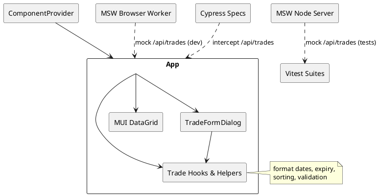

# Trade Desk (React + Vite + MUI)

A single-page trade management experience built with React 19, TypeScript, Vite, and Material UI.  
It showcases:

- **Mocked backend** powered by MSW (browser worker in dev, node server in tests).
- **MUI X DataGrid** with auto-expiry chips, pagination, and ISO date formatting.
- **Create/Edit Trade dialog** using `react-hook-form` + Zod validation (rejects past maturity, enforces version rules).
- **Testing stack**: Vitest + Testing Library + MSW for unit/integration, Cypress for E2E validation.
- **CI pipeline** (GitHub Actions) running install → typecheck → lint → build → tests → Cypress → `npm audit --audit-level=critical`.

## Getting Started

```bash
npm install
npm run dev
```

The dev server auto-loads MSW mocks and hot reloads changes.

## Available Scripts

| Script                               | Purpose                                        |
| ------------------------------------ | ---------------------------------------------- |
| `npm run dev`                        | Start Vite dev server                          |
| `npm run build`                      | Type-check + production build                  |
| `npm run preview`                    | Preview prod build locally                     |
| `npm run typecheck`                  | Run `tsc --noEmit`                             |
| `npm run lint`                       | ESLint over the repo                           |
| `npm run test` / `npm run test:unit` | Vitest (jsdom) suite with MSW                  |
| `npm run test:e2e`                   | Builds, serves, then runs Cypress headless     |
| `npm run cypress:run`                | Cypress headless only (expects server running) |

## Testing Notes

- **Unit/Integration** live in `src/__tests__`. Each test can override MSW handlers via `server.use`.
- **E2E** specs in `cypress/e2e`. API requests are intercepted per test to keep scenarios deterministic.
- **Setup hooks** (`src/setupTests.ts`) automatically start/stop the MSW node server and mock CSS imports required by MUI DataGrid.

## Component Hierarchy (PlantUML)




## CI/CD

Located at `.github/workflows/ci.yml`. The pipeline:

1. Installs dependencies with `npm ci`.
2. Runs `npm run typecheck`, `npm run lint`, `npm run build`.
3. Executes Vitest (`npm run test`).
4. Launches Cypress via `npm run test:e2e` (build → preview → headless tests).
5. Performs `npm audit --audit-level=critical` to fail on critical vulnerabilities.

## Tech Stack

- React 19 + Vite 7 + TypeScript
- Material UI (core + icons) & MUI X DataGrid
- react-hook-form + Zod
- MSW for API mocking
- Vitest + React Testing Library + jsdom
- Cypress (Electron headless)
- GitHub Actions for CI, npm audit for vulnerability scanning
